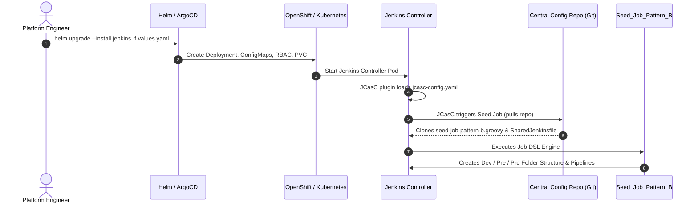
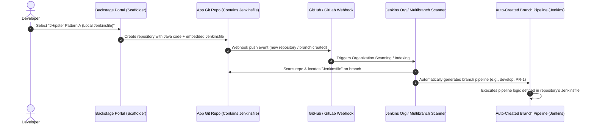
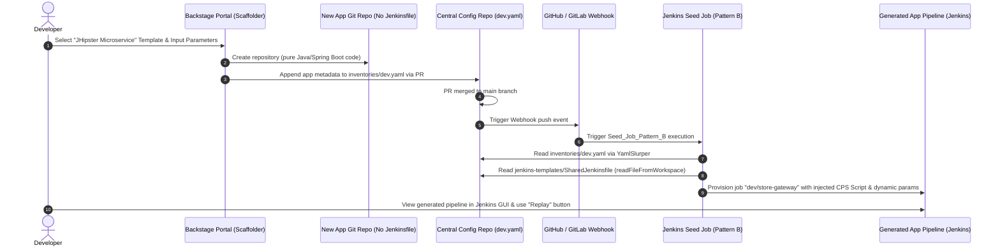
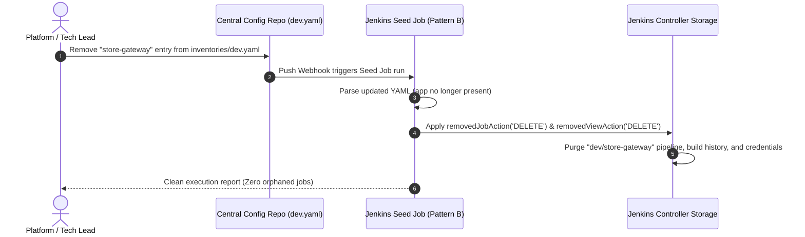
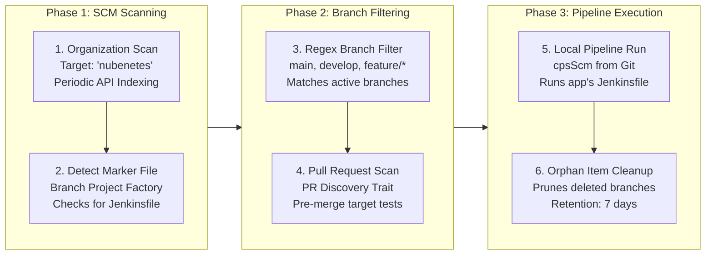
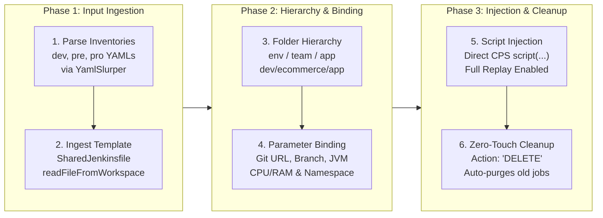
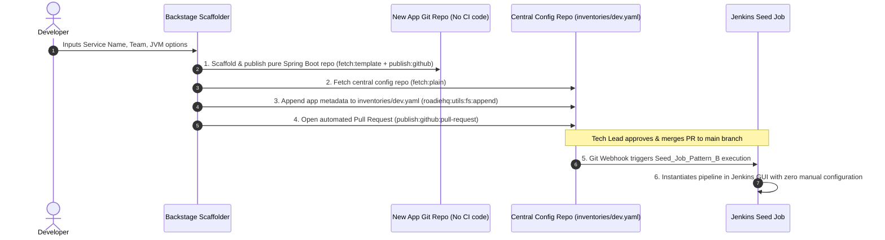

# ⚙️ Jenkins + Backstage GitOps Integration Patterns (2026 Reference Architecture)

> [!WARNING]
> **⚠️ DIDACTIC TEMPLATE ONLY: This repository is a conceptual blueprint generated with Antigravity Gemini 3.7 Flash. It has NOT been tested, validated, or debugged in a live, real-world Kubernetes/OpenShift cluster. Use it solely as a learning guide and architectural reference.**

<!-- ======================================================================= -->
<!-- GITHUB REPOSITORY BADGES                                                -->
<!-- ======================================================================= -->
<p align="center">
  <!-- Core Architecture & CI/CD Status -->
  <a href="https://github.com/nubenetes/jenkins-backstage-gitops-patterns/actions/workflows/ci.yml"></a>
  <a href="https://github.com/nubenetes/jenkins-backstage-gitops-patterns"></a>
  <a href="https://jenkins.io"></a>
  <a href="https://backstage.io"></a>
  <a href="https://argo-cd.readthedocs.io"></a>
  <a href="https://www.redhat.com/en/technologies/cloud-computing/openshift"></a>
  <a href="https://kubernetes.io"></a>
</p>

<p align="center">
  <!-- Stack, Supply Chain Security & Observability -->
  
  
  
  
  
  
  
  
  
  
  
  <a href="https://github.com/nubenetes/jenkins-backstage-gitops-patterns/blob/main/LICENSE"></a>
</p>

<p align="center">
  <!-- Repository Statistics & Standards -->
  <a href="https://github.com/nubenetes/jenkins-backstage-gitops-patterns/stargazers"></a>
  <a href="https://github.com/nubenetes/jenkins-backstage-gitops-patterns/network/members"></a>
  <a href="https://github.com/nubenetes/jenkins-backstage-gitops-patterns/issues"></a>
  <a href="https://github.com/nubenetes/jenkins-backstage-gitops-patterns/pulls"></a>
  
  
</p>

---

<a id="about-this-repository"></a>
## 📌 About This Repository

> **One-liner Description (GitHub About):**
> *Enterprise Platform Engineering blueprint integrating Spotify Backstage with Jenkins on OpenShift using Job DSL, JCasC, GitOps inventories, Supply Chain Security (SLSA, Cosign, Syft), and ArgoCD.*

### 🏷️ GitHub Topics / Tags
`backstage` • `jenkins` • `gitops` • `job-dsl` • `jcasc` • `openshift` • `kubernetes` • `argocd` • `spring-boot` • `java-21` • `slsa` • `cosign` • `syft` • `gitleaks` • `opentelemetry` • `grafana` • `sonarqube` • `platform-engineering` • `microservices` • `devops`

---

## 📑 Table of Contents
1. [About This Repository](#about-this-repository)
2. [Executive Summary](#executive-summary)
3. [Architectural Comparison: Pattern A vs. Pattern B](#architectural-comparison)
4. [System Architecture & Lifecycle Flows (Mermaid)](#system-architecture-flows)
   - [Flow 1: Day-1 Bootstrap (JCasC & Seed Job Initialization)](#flow-1-bootstrap)
   - [Flow 2: Pattern A Reactive Lifecycle (Backstage → App Repo with Jenkinsfile → Branch Scanner)](#flow-2-pattern-a-lifecycle)
   - [Flow 3: Pattern B Day-2 Operations (Backstage → YAML Inventory → Pipeline Injection)](#flow-3-operations)
   - [Flow 4: Pattern B Decommissioning & Automated Garbage Collection](#flow-4-decommissioning)
5. [Deep Dive: Pattern A (Reactive Multibranch & Org Discovery)](#deep-dive-pattern-a)
   - [Core Mechanics & Job DSL Engine](#pattern-a-mechanics)
   - [The Backstage Scaffolder Flow in Pattern A](#pattern-a-backstage)
   - [Enterprise Pitfalls: The 200 Repos PR Problem & Shared Library Traps](#pattern-a-pitfalls)
   - [When to Use Pattern A](#when-to-use-pattern-a)
6. [Deep Dive: Pattern B (Git-Backed Centralized Seed Job)](#deep-dive-pattern-b)
   - [Core Architecture & Execution Pipeline](#pattern-b-architecture)
   - [Solving the 4 Critical Jenkins Shared Library (JSL) Anti-Patterns](#pattern-b-jsl-comparison)
   - [The Backstage Scaffolder GitOps Workflow in Pattern B](#pattern-b-backstage-workflow)
   - [Multi-Environment Promotion Matrix (dev → pre → pro)](#pattern-b-promotion-matrix)
   - [Automated Zero-Touch Decommissioning & Garbage Collection](#pattern-b-decommissioning-mechanics)
7. [Enterprise Platform Engineering Extensions](#enterprise-extensions)
   - [1. Software Supply Chain Security (SLSA, Syft SBOM, Cosign, Gitleaks)](#ext-supply-chain-security)
   - [2. Backstage Portal & Tech Insights Scorecards](#ext-backstage-devex)
   - [3. CI for CI: Automated Validation & Dry-Run Simulation](#ext-ci-for-ci)
   - [4. Zero-Trust Secrets & Team Folder RBAC](#ext-zero-trust-rbac)
   - [5. Observability: OpenTelemetry & Grafana Dashboards](#ext-observability)
   - [6. Hybrid GitOps: ArgoCD 3.5 & OpenShift GitOps Bridge](#ext-argocd-bridge)
8. [Repository Structure](#repository-structure)
9. [Component Breakdown](#component-breakdown)
   - [1. Helm Chart Wrapper (`charts/jenkins-wrapper`)](#component-helm-wrapper)
   - [2. JCasC Definition (`bootstrap/jcasc-config.yaml`)](#component-jcasc-bootstrap)
   - [3. Job DSL Pattern A Engine (`job-dsl/seed-job-pattern-a.groovy`)](#component-job-dsl-pattern-a)
   - [4. Job DSL Pattern B Engine (`job-dsl/seed-job-pattern-b.groovy`)](#component-job-dsl-engine)
   - [5. Shared Declarative Jenkinsfile (`jenkins-templates/SharedJenkinsfile`)](#component-shared-jenkinsfile)
   - [6. Environment Inventories (`inventories/*.yaml`)](#component-environment-inventories)
   - [7. Backstage Scaffolder Templates (`backstage/templates`)](#component-backstage-templates)
   - [8. Sample JHipster Microservice (`samples/jhipster-microservice`)](#component-jhipster-microservice)
10. [Enterprise OpenShift, ArgoCD 3.5 & Modern Stack Standards](#openshift-kubernetes-considerations)
11. [Step-by-Step Operations Guide](#step-by-step-guide)
    - [1. Day-1: Bootstrap Jenkins Controller](#guide-day-1-bootstrap)
    - [2. Day-2 Pattern A: Provision Multibranch Scanner](#guide-day-2-pattern-a)
    - [3. Day-2 Pattern B: Register a New Application](#guide-day-2-register)
    - [4. Day-3 Pattern B: Decommission an Application](#guide-day-3-decommission)
12. [References & Works Cited](#references)
13. [License](#license)

---

<a id="executive-summary"></a>
## 🎯 Executive Summary

When integrating developer self-service portals (**Spotify Backstage**) with continuous integration engines (**Jenkins**) on modern Kubernetes and Red Hat OpenShift clusters, platform teams face a critical architectural decision: **How should application CI/CD pipelines be created, maintained, standardized, and decommissioned?**

This repository demonstrates and contrasts two major enterprise patterns:
* **Pattern A (Reactive Branch Discovery / Multibranch Pipelines)**: Each application repository contains an individual `Jenkinsfile`. Jenkins monitors organization accounts or repositories and creates pipelines upon discovering branches.
* **Pattern B (Git-Backed Centralized Seed Job / Inventory Model)**: Application repositories contain *no* CI infrastructure code (`Jenkinsfile` is omitted). Applications are registered as metadata entries in environment-specific Git inventories (`inventories/dev.yaml`, `inventories/pre.yaml`, `inventories/pro.yaml`). A centralized Jenkins Seed Job (powered by **Job DSL** and **Jenkins Configuration as Code - JCasC**) reads a single canonical `SharedJenkinsfile` using `readFileFromWorkspace` and injects it directly into dynamically provisioned Jenkins pipeline jobs.

---

<a id="architectural-comparison"></a>
## ⚖️ Architectural Comparison: Pattern A vs. Pattern B

| Evaluation Dimension | Pattern A: Reactive Branch Discovery (Multibranch) | Pattern B: Centralized Seed Job (Inventory-Driven) |
| :--- | :--- | :--- |
| **Day-1 Complexity** | **Low**. Quick to set up. Requires configuring GitHub/GitLab org folders or multibranch webhooks. | **Medium**. Requires configuring JCasC, Job DSL Seed Job, and structured YAML inventories in a control repository. |
| **Day-2 Maintenance (Enterprise Governance)** | **Very High Pain**. Adding a mandatory step (e.g., SonarQube quality gate or Trivy container scan) across 200+ microservices requires opening 200+ Git PRs or enforcing rigid Shared Libraries. | **Near Zero Pain**. Updating `jenkins-templates/SharedJenkinsfile` in this central repo immediately updates all 200+ jobs upon the next Seed Job run. |
| **Developer Experience (UI & Replay)** | **Variable**. If using Shared Libraries, custom steps obscure pipeline logic. Replay functionality may be disabled or crash due to dynamic CPS mismatch. | **Superior**. Injected declarative Jenkinsfile is rendered directly in the Jenkins GUI. Developers have full access to the **Pipeline Replay** button for debugging. |
| **App Repository Hygiene** | **Polluted**. Every microservice repository contains boilerplate pipeline scripts, credentials references, and cluster-specific configurations. | **Clean & Zero-Config**. Application repositories contain pure business code (e.g., JHipster Spring Boot), completely decoupled from CI/CD tooling. |
| **Configuration Drift** | **High**. Teams modify or fork their local `Jenkinsfile`, introducing security holes, disabled linters, or outdated container base images. | **Zero**. Standardized centrally. Environment variables, resources, and stages are driven strictly by the YAML inventories. |
| **Decommissioning & Cleanup** | **Manual / Orphaned**. Deleting an app repository leaves orphaned jobs, credentials, and cron triggers in Jenkins unless manual sweeping is performed. | **Automated & Instantaneous**. Removing the application block from `inventories/dev.yaml` triggers Job DSL garbage collection (`removedJobAction('DELETE')`). |
| **Branching Strategy Handling** | Native to Git branch names (e.g. `feature/*`, `bugfix/*`). | Configured per environment in YAML (e.g., `dev` targets `develop`/`feature/*`, `pro` targets `main`/`release/*`). |

---

<a id="system-architecture-flows"></a>
## 📊 System Architecture & Lifecycle Flows

<a id="flow-1-bootstrap"></a>
### Flow 1: Day-1 Bootstrap (JCasC & Seed Job Initialization)
This flow illustrates how Jenkins is provisioned in OpenShift/Kubernetes with zero manual UI interaction using Helm and Jenkins Configuration as Code (JCasC).



---

<a id="flow-2-pattern-a-lifecycle"></a>
### Flow 2: Pattern A Reactive Lifecycle (Backstage → App Repo with Jenkinsfile → Branch Scanner)
This flow demonstrates the classic Pattern A architecture: Backstage scaffolds an application containing a local `Jenkinsfile`, and Jenkins reactively discovers branches through organization scanning.



---

<a id="flow-3-operations"></a>
### Flow 3: Pattern B Day-2 Operations (Backstage → YAML Inventory → Pipeline Injection)
This flow demonstrates a developer scaffolding a new JHipster microservice via Backstage in Pattern B, registering the service in GitOps inventories without any CI code in the app repo.



---

<a id="flow-4-decommissioning"></a>
### Flow 4: Pattern B Decommissioning & Automated Garbage Collection
This flow shows how simple deletion of metadata in the Git inventory safely purges Jenkins pipelines and folders without manual operator intervention.



---

<a id="deep-dive-pattern-a"></a>
## 🔍 Deep Dive: Pattern A (Reactive Multibranch & Org Discovery)

<a id="pattern-a-mechanics"></a>
### Core Mechanics & Job DSL Engine
In **Pattern A**, the continuous integration architecture relies on the **GitHub Branch Source Plugin** (or GitLab/Bitbucket equivalents) configured via `job-dsl/seed-job-pattern-a.groovy`.

The reactive discovery engine executes a 6-stage discovery and lifecycle flow:



#### Step-by-Step Mechanics:
1. **Organization Scanning**: `organizationFolder` periodically queries the GitHub API or reacts to push/repository webhooks across the organization.
2. **Marker File Detection**: The factory inspects branch trees for the presence of a root `Jenkinsfile`. Repositories without a `Jenkinsfile` are ignored.
3. **Branch Filtering**: `sourceRegexFilter` evaluates branch names against enterprise standards (e.g. `main`, `develop`, `feature/*`, `release/*`).
4. **Pull Request Discovery**: PR discovery builds a temporary pre-merge commit against the target branch (`strategyId: 1`), running tests before merging.
5. **Decentralized SCM Execution**: Pipeline instructions are fetched directly from the application repository's own `Jenkinsfile`.
6. **Orphan Garbage Collection**: When a feature branch or PR is merged and deleted in Git, `orphanedItemStrategy` discards the corresponding Jenkins job after the retention window (e.g., 7 days).

<a id="pattern-a-backstage"></a>
### The Backstage Scaffolder Flow in Pattern A
When a developer uses `backstage/templates/pattern-a-app-template.yaml`:
1. The developer inputs the service name, owning team, and destination repository.
2. Backstage uses `fetch:template` to generate the application source code **and embeds a static `Jenkinsfile` into the repository root**.
3. Backstage publishes the new repo to GitHub via `publish:github`.
4. The GitHub Webhook fires on the initial commit push.
5. Jenkins Organization Folder picks up the new repo, identifies the `Jenkinsfile`, and automatically creates the Multibranch Pipeline without central inventory configuration.

<a id="pattern-a-pitfalls"></a>
### Enterprise Pitfalls: The "200 Repos PR Problem" & Shared Library Traps
While Pattern A provides low initial friction on Day-1, enterprise platform engineering teams encounter severe Day-2 operational bottlenecks:

1. **The 200 Repos PR Bottleneck**:
   Suppose the security team mandates adding a container vulnerability scanner (e.g., Trivy or Prisma Cloud) to all CI pipelines. In Pattern A, the platform team must submit, review, and merge Pull Requests across **200+ distinct microservice repositories**. In practice, this results in weeks of backlog, merge conflicts, and high configuration drift as teams lag behind.

2. **The Shared Library Anti-Pattern**:
   To avoid modifying 200 `Jenkinsfile`s, teams often introduce a **Jenkins Shared Library (JSL)** (e.g. `@Library('enterprise-lib') _` calling `standardPipeline()`). While this centralizes logic, it introduces critical downsides:
   - **Broken Replay Button**: Developers cannot edit or debug library methods (`vars/*.groovy`) in the Jenkins UI Replay view.
   - **Opaque UI**: Pipeline logic is hidden behind a single method call, creating developer confusion during pipeline failures.
   - **Global Blast Radius**: A syntax error in the Shared Library's `master` branch can simultaneously break every build in the enterprise.

<a id="when-to-use-pattern-a"></a>
### When to Use Pattern A
Pattern A remains a suitable architectural choice when:
* Teams are small or autonomous with completely heterogeneous, polyglot tech stacks (e.g., Go, Rust, Python, Java) requiring distinct pipeline structures.
* Development teams have full ownership of their CI infrastructure and prefer local `Jenkinsfile` autonomy over centralized standardization.

---

<a id="deep-dive-pattern-b"></a>
## 🔍 Deep Dive: Pattern B (Git-Backed Centralized Seed Job)

<a id="pattern-b-architecture"></a>
### Core Architecture & Execution Pipeline
Pattern B represents an **inventory-driven GitOps model** where application repositories contain zero CI/CD infrastructure code.

The Job DSL Seed Job (`job-dsl/seed-job-pattern-b.groovy`) executes a 6-stage provisioning lifecycle:



#### Step-by-Step Mechanics:
1. **Inventory Parsing**: Groovy's `YamlSlurper` reads multi-environment inventories from `inventories/dev.yaml`, `inventories/pre.yaml`, and `inventories/pro.yaml`.
2. **Template Ingestion**: The Job DSL engine calls `readFileFromWorkspace('jenkins-templates/SharedJenkinsfile')` to load the centralized declarative pipeline string into memory.
3. **Folder Tree Provisioning**: The engine creates the hierarchy `<env>/<team-name>/<app-name>` dynamically.
4. **Dynamic Token & Parameter Binding**: Metadata defined in the inventory (repository URL, target Git branch, JVM memory allocations, CPU/memory limits, OpenShift namespaces, replica counts, SonarQube flags) are bound as Jenkins job parameters.
5. **Direct CPS Script Injection**: The declarative pipeline string is injected directly into the job definition via `definition { cps { script(sharedJenkinsfileTemplate); sandbox(true) } }`.

---

<a id="pattern-b-jsl-comparison"></a>
### Solving the 4 Critical Jenkins Shared Library (JSL) Anti-Patterns

| Dimension | Standard Jenkins Shared Library (`@Library`) | Pattern B: Direct Template Injection (`Job DSL + CPS`) |
| :--- | :--- | :--- |
| **Pipeline Replay Button** | ❌ **Broken / Useless**. Developers can only edit the single-line caller `Jenkinsfile`. Library files (`vars/*.groovy`) cannot be edited during replay. | ✅ **100% Functional**. The complete injected declarative script is stored in the job and fully editable in the Replay GUI. |
| **GUI Transparency** | ❌ **Opaque Black Box**. The Jenkins UI only displays a single step call like `standardPipeline()`. | ✅ **Crystal Clear**. Full declarative pipeline structure with explicit stages, steps, and parameters is rendered in the Jenkins console. |
| **Blast Radius & Rollout Safety** | ❌ **High Risk**. Updating `@Library('enterprise-lib@master')` immediately impacts all repos in production. | ✅ **Multi-Environment Isolation**. Template updates can be deployed to `dev` first, verified on test builds, and safely promoted to `pre` and `pro`. |
| **Security & CPS Sandboxing** | ❌ **Complex Sandbox Management**. Custom Groovy classes in `src/` require administrator method whitelisting or run unsandboxed. | ✅ **Zero Script Approval Hassle**. Declarative pipelines execute within standard CPS sandbox restrictions with zero administrative approvals required. |

---

<a id="pattern-b-backstage-workflow"></a>
### The Backstage Scaffolder GitOps Workflow in Pattern B
Pattern B seamlessly decouples the developer experience from Jenkins management through the Backstage Scaffolder:



---

<a id="pattern-b-promotion-matrix"></a>
### Multi-Environment Promotion Matrix (dev → pre → pro)
In Pattern B, microservice promotion across environments is executed purely via GitOps pull requests between inventory files:

| Attribute | Development (`inventories/dev.yaml`) | Pre-Production (`inventories/pre.yaml`) | Production (`inventories/pro.yaml`) |
| :--- | :--- | :--- | :--- |
| **Target Cluster** | `openshift-dev-cluster-01` | `openshift-stage-cluster-01` | `openshift-prod-cluster-01` |
| **Target Namespace** | `apps-dev` | `apps-pre` | `apps-pro` |
| **Source Git Branch** | `develop` or `feature/*` | `release/v*` | `main` |
| **Container Build** | ✅ Kaniko builds image & pushes to registry | ✅ Kaniko builds release candidate image | 🔒 Pulls immutable tagged image verified in `pre` |
| **Default JVM Opts** | `-Xms256m -Xmx512m` | `-Xms512m -Xmx1024m` | `-Xms1024m -Xmx2048m` |
| **Default Replicas** | 1 | 2 | 3-4 (with HPA) |
| **SonarQube Quality Gate** | Informational warning | Warning / Soft block | 🛑 Strict pipeline failure on Gate breach |

---

<a id="pattern-b-decommissioning-mechanics"></a>
### Automated Zero-Touch Decommissioning & Garbage Collection
In traditional Jenkins setups, decommissioning a service leaves behind abandoned build jobs, outdated webhook triggers, and orphaned secrets.

In Pattern B, decommissioning is an automated GitOps operation:
1. An operator or Backstage action removes the microservice entry from `inventories/dev.yaml`.
2. The change is committed and pushed to the `main` branch.
3. The Jenkins Seed Job runs and detects that the job is no longer present in the parsed YAML structure.
4. Job DSL executes `removedJobAction('DELETE')` and `removedViewAction('DELETE')`, cleanly destroying the Jenkins pipeline, build history, workspace allocation, and folder structures.

---

<a id="enterprise-extensions"></a>
## 🛡️ Enterprise Platform Engineering Extensions

<a id="ext-supply-chain-security"></a>
### 1. Software Supply Chain Security (SLSA, Syft SBOM, Cosign, Gitleaks)
Modern enterprise CI/CD requires comprehensive supply chain integrity:
* **Pre-Build Secret Scanning (Gitleaks)**: The dynamic agent runs `zricethezav/gitleaks:latest` across the workspace before any compilation occurs, preventing credential leakages.
* **SBOM Generation (Anchore Syft)**: During container packaging, Syft inspects application dependencies and generates a standard **CycloneDX JSON** Software Bill of Materials (`target/*.cdx.json`), which is archived as a permanent build artifact.
* **Cryptographic Image Signing & Attestation (Sigstore Cosign)**: Kaniko container builds are signed keylessly via OpenShift OIDC ServiceAccount tokens, and the CycloneDX SBOM is cryptographically attached as an in-toto attestation.

<a id="ext-backstage-devex"></a>
### 2. Backstage Portal & Tech Insights Scorecards
* **Live CI/CD Annotations**: Generated microservices embed standard Backstage annotations linking the developer portal entity view directly to Jenkins pipelines and SonarQube quality metrics:
  ```yaml
  metadata:
    annotations:
      jenkins.io/job-full-name: dev/e-commerce/store-gateway
      sonarqube.org/project-key: store-gateway-dev
      backstage.io/techdocs-ref: dir:.
  ```
* **Production Readiness Scorecards (`backstage/tech-insights/scorecards.yaml`)**: Automatically evaluates microservices against enterprise standards (inventory registration in `inventories/*.yaml`, SonarQube line coverage $\ge 80\%$, SBOM artifact generation, and Cosign signature verification).

<a id="ext-ci-for-ci"></a>
### 3. CI for CI: Automated Validation & Dry-Run Simulation
To protect the central controller from broken configurations:
* **GitHub Actions Workflow (`.github/workflows/ci.yml`)**: Automatically triggers on PRs modifying inventories, running `yamllint`, validating JCasC schema, and executing Job DSL dry-run simulations.
* **Dry-Run CLI Simulation (`bin/simulate-seed.sh`)**: Platform engineers can simulate the exact hierarchy of Jenkins folders, parameters, and pipelines that Job DSL will generate:
  ```bash
  ./bin/simulate-seed.sh
  ```

<a id="ext-zero-trust-rbac"></a>
### 4. Zero-Trust Secrets & Team Folder RBAC
* **Matrix-Based Authorization Strategy (`projectMatrix`)**: Configured via JCasC (`bootstrap/jcasc-config.yaml`) to enforce least-privilege access.
* **Team-Scoped Folder Permissions**: Pattern B Seed Job dynamically assigns scoped permissions (`Job/Read`, `Job/Build`, `Job/Replay`) to owning team groups (`group:team-<teamName>`), preventing unauthorized builds across teams while granting platform engineering global governance.

<a id="ext-observability"></a>
### 5. Observability: OpenTelemetry & Grafana Dashboards
* **OpenTelemetry Distributed Tracing**: Enabled via `opentelemetry:2.17.0` plugin in Helm values, exporting pipeline stage durations and controller queue latency directly to OpenTelemetry collectors.
* **Pre-built Grafana Dashboard (`dashboards/jenkins-gitops-metrics.json`)**: Tracks Seed Job duration, total active pipelines across environments, p95 agent startup latency, and success rates per engineering team.

<a id="ext-argocd-bridge"></a>
### 6. Hybrid GitOps: ArgoCD 3.5 & OpenShift GitOps Bridge
* **Automated Manifest Promotion & Synchronization**: In `jenkins-templates/SharedJenkinsfile`, stage `GitOps Deployment (ArgoCD 3.5 Bridge)` leverages the native `quay.io/argoproj/argocd:v3.5.0` container inside the dynamic Kubernetes agent pod to update GitOps deployment manifests and trigger instant declarative synchronization:
  ```bash
  argocd app sync ${APPLICATION_NAME}-${TARGET_ENV} --prune --apply-out-of-sync-only --server-side-apply
  argocd app wait ${APPLICATION_NAME}-${TARGET_ENV} --health --timeout 180
  ```
* **Declarative ArgoCD 3.5 Manifest (`gitops/argocd/application.yaml`)**: Standard `argoproj.io/v1alpha1` specification configured with **Server-Side Apply (`ServerSideApply=true`)**, `RespectIgnoreDifferences=true`, `PruneLast=true`, `FailOnSharedResource=true`, and sync wave tracking annotations (`argocd.argoproj.io/sync-wave`).

---

<a id="repository-structure"></a>
## 📂 Repository Structure

```text
.
├── README.md                          # Comprehensive documentation, comparison, and diagrams
├── LICENSE                            # Apache License 2.0
├── .github/
│   └── workflows/
│       └── ci.yml                     # GitHub Actions: Linting, validation & Job DSL simulation
├── .yamllint.yml                      # Enterprise YAML linting rules
├── charts/
│   └── jenkins-wrapper/               # Custom Helm Chart wrapper for Jenkins
│       ├── Chart.yaml                 # Helm Chart metadata with Jenkins dependency
│       └── values.yaml                # JCasC, plugins, RBAC, and OpenTelemetry configuration
├── bootstrap/
│   └── jcasc-config.yaml              # Standalone JCasC configuration with Matrix RBAC & OTel
├── job-dsl/
│   ├── seed-job-pattern-a.groovy      # Job DSL for Pattern A (Organization folder / Branch scan)
│   └── seed-job-pattern-b.groovy      # Job DSL for Pattern B (YAML inventory iterator + CPS injection + RBAC)
├── jenkins-templates/
│   └── SharedJenkinsfile              # Shared Declarative Pipeline (Gitleaks, Syft, Cosign, ArgoCD 3.5)
├── inventories/                       # Pattern B Multi-Environment Inventories
│   ├── dev.yaml                       # Microservices list and parameters for Dev
│   ├── pre.yaml                       # Microservices list and parameters for Pre-production
│   └── pro.yaml                       # Microservices list and parameters for Production
├── backstage/
│   ├── catalog-info.yaml              # Central infrastructure catalog entity
│   ├── tech-insights/
│   │   └── scorecards.yaml            # Backstage Production Readiness Scorecards
│   └── templates/
│       ├── catalog-info-template.yaml # Component catalog template for microservices
│       ├── pattern-a-app-template.yaml # Backstage template: provisions app with local Jenkinsfile
│       └── pattern-b-app-template.yaml # Backstage template: registers app in inventories/ (No Jenkinsfile)
├── dashboards/
│   └── jenkins-gitops-metrics.json    # Production-ready Grafana metrics dashboard
├── gitops/
│   └── argocd/
│       └── application.yaml           # Modern ArgoCD v3.5 Application (ServerSideApply, auto-sync, sync waves)
├── samples/
│   └── jhipster-microservice/         # Minimal JHipster Java microservice stub (No Jenkinsfile in repo)
│       ├── pom.xml                    # Spring Boot / Maven definition
│       └── src/                       # Application code stub
└── bin/                               # Operational scripts (Day 1, Day 2, Simulation, Decommission)
    ├── bootstrap.sh                   # Unified script to spin up the local/OpenShift setup
    ├── simulate-seed.sh               # Dry-run CLI tool: parses YAMLs and previews Job DSL output
    ├── register-app.sh                # Simulation script: registers a new app in Pattern B inventories
    └── decommission.sh                # Simulation script: removes an app and triggers cleanup
```

---

<a id="component-breakdown"></a>
## 🧩 Component Breakdown

<a id="component-helm-wrapper"></a>
### 1. Helm Chart Wrapper (`charts/jenkins-wrapper`)
Wraps the official Jenkins Helm Chart (`jenkins/jenkins`) and packages the required Kubernetes configurations:
* **Pre-installed Plugins**: `configuration-as-code`, `job-dsl`, `kubernetes`, `workflow-aggregator`, `git`, `sonar`, `pipeline-stage-view`.
* **JCasC Integration**: Mounts the Job DSL bootstrap scripts directly into the controller container.
* **Kubernetes Pod Cloud**: Pre-configures the dynamic Pod Cloud for agent scheduling.

<a id="component-jcasc-bootstrap"></a>
### 2. JCasC Definition (`bootstrap/jcasc-config.yaml`)
Configures the Jenkins controller as code:
* Sets up security realms and authorization matrices.
* Defines the Kubernetes cloud provider with container agent specifications (`maven`, `kaniko`, `oc-cli`).
* Provisions the initial bootstrap **Seed Jobs** (`Seed_Job_Pattern_A` and `Seed_Job_Pattern_B`) that clone this repository.

<a id="component-job-dsl-pattern-a"></a>
### 3. Job DSL Pattern A Engine (`job-dsl/seed-job-pattern-a.groovy`)
A Groovy script configuring the reactive discovery engine:
* **Organization Folder**: Configures GitHub Organization scanning (`organizationFolder`) across the `nubenetes` org.
* **Discovery Traits**: Configures branch discovery regex filters (`main`, `develop`, `feature/*`, `release/*`), PR origin discovery, and fork trust levels.
* **Orphaned Item Strategy**: Cleans up deleted branch jobs automatically after 7 days.
* **Multibranch Pipelines**: Demonstrates standalone multi-branch scanners targeted at individual repositories containing a root `Jenkinsfile`.

<a id="component-job-dsl-engine"></a>
### 4. Job DSL Pattern B Engine (`job-dsl/seed-job-pattern-b.groovy`)
A Groovy script that:
* Uses `groovy.yaml.YamlSlurper` to parse `inventories/dev.yaml`, `inventories/pre.yaml`, and `inventories/pro.yaml`.
* Creates top-level environment folders (`dev`, `pre`, `pro`) and application subfolders.
* Reads `jenkins-templates/SharedJenkinsfile` using `readFileFromWorkspace`.
* Injects the pipeline code directly via `cps { script(...) }`.
* Dynamically maps YAML metadata (JVM limits, replicas, namespace, Git branch, SonarQube flags) into Jenkins job environment variables and parameters.
* Configures `removedJobAction('DELETE')` and `removedViewAction('DELETE')` for zero-touch decommissioning.

<a id="component-shared-jenkinsfile"></a>
### 5. Shared Declarative Jenkinsfile (`jenkins-templates/SharedJenkinsfile`)
A declarative pipeline template for JHipster/Java microservices with:
* **Dynamic Pod Agent**: Runs multi-container pods (`maven`, `sonar-scanner`, `kaniko`, `openshift-cli`).
* **Environment-Aware Stages**:
  * `Compile & Test`: Maven build and Jacoco test reports.
  * `Security & Quality`: SonarQube analysis and dependency scanning.
  * `Container Image Build`: Kaniko or OpenShift BuildConfigs (executes on `dev` or on release tags).
  * `Continuous Deployment`: GitOps sync / OpenShift deployment rollout to the target namespace.

<a id="component-environment-inventories"></a>
### 6. Environment Inventories (`inventories/*.yaml`)
Structured configuration matrices defining the desired state of all microservices per environment:
```yaml
environment: dev
cluster: openshift-dev-cluster-01
namespace: apps-dev
defaults:
  jvm_memory: "-Xms512m -Xmx1024m"
  cpu_limit: "1000m"
  memory_limit: "1Gi"
applications:
  - name: store-gateway
    team: e-commerce
    repository: "https://github.com/nubenetes/sample-jhipster-gateway.git"
    branch: "develop"
    sonar_enabled: true
    replicas: 2
```

<a id="component-backstage-templates"></a>
### 7. Backstage Scaffolder Templates (`backstage/templates`)
* **`pattern-a-app-template.yaml`**: The classic template. Generates an application repository containing a static `Jenkinsfile` inside the app root for reactive branch discovery.
* **`pattern-b-app-template.yaml`**: The GitOps inventory template. Clones the application boilerplate *without* a `Jenkinsfile`, then uses Backstage actions (`fetch:plain`, file append, and `publish:github:pull-request`) to submit a Pull Request to this configuration repository's `inventories/dev.yaml`.

<a id="component-jhipster-microservice"></a>
### 8. Sample JHipster Microservice (`samples/jhipster-microservice`)
A standard Java 21 / Spring Boot 3 JHipster microservice stub. Notice that **no `Jenkinsfile` exists in this folder**, proving complete isolation between developer business code and platform CI/CD pipelines.

---

<a id="openshift-kubernetes-considerations"></a>
## 🛡️ Enterprise OpenShift, ArgoCD 3.5 & Modern Stack Standards

This blueprint is engineered to adhere to the latest stable enterprise releases and modern platform engineering practices:

| Component | Target Release | Architectural Standards & Recommended Configurations |
| :--- | :--- | :--- |
| **Red Hat OpenShift** | **v4.16 / v4.17 (K8s 1.30/1.31)** | Strict compliance with `restricted-v2` Security Context Constraints (SCC): `runAsNonRoot: true`, `allowPrivilegeEscalation: false`, `seccompProfile: { type: RuntimeDefault }`, `capabilities: { drop: ["ALL"] }`. TLS edge-termination Routes with HAProxy 5m timeout. |
| **ArgoCD / OpenShift GitOps** | **v3.5 (Latest Stable)** | Declarative `Application` (`argoproj.io/v1alpha1`) leveraging **Server-Side Apply (`ServerSideApply=true`)**, Automated Pruning (`prune: true`, `PruneLast=true`), Self-Healing (`selfHeal: true`), `FailOnSharedResource=true`, and sync waves (`argocd.argoproj.io/sync-wave`). |
| **Jenkins Controller & Agents** | **LTS v2.479.3+ (Java 21 LTS)** | Native Eclipse Temurin JDK 21 LTS runtime. Headless controller execution (`-Djava.awt.headless=true`), Jenkins Configuration as Code (JCasC), Project Matrix RBAC, and dynamic Kubernetes agent clouds. |
| **Helm Package Manager** | **v3.16+ / v4.x** | Standard `apiVersion: v2` chart specification with OCI registry chart distribution support and atomic installation flags (`--atomic --timeout 5m`). |
| **Spotify Backstage** | **v1.30+ / Backend System v2** | Scaffolder `v1beta3` action pipelines, declarative plugin architecture, TechDocs integration, and automated Tech Insights Production Readiness Scorecards. |
| **Spring Boot Microservices** | **v3.4.x / Java 21 LTS** | Spring Boot 3.4 with Java 21 virtual threads, actuator health metrics, CycloneDX Maven plugin, and Jacoco unit test coverage $\ge 80\%$. |
| **Supply Chain Security** | **SLSA Level 3 Ready** | Gitleaks v8.21+ secret scanning, Anchore Syft v1.17+ CycloneDX SBOM generator, and Sigstore Cosign v2.4+ keyless container image signing. |

---

<a id="step-by-step-guide"></a>
## 🚀 Step-by-Step Operations Guide

<a id="guide-day-1-bootstrap"></a>
### 1. Day-1: Bootstrap Jenkins Controller
Deploy Jenkins with the Helm wrapper and bootstrap the Seed Jobs:
```bash
# Execute Day-1 bootstrap script
./bin/bootstrap.sh jenkins-ci
```

<a id="guide-day-2-pattern-a"></a>
### 2. Day-2 Pattern A: Provision Multibranch & Org Discovery Scanner
Trigger the Pattern A Seed Job to scan the GitHub organization for repositories with local `Jenkinsfile`s:
```bash
# Trigger Seed_Job_Pattern_A via Jenkins CLI or UI
# Access: http://localhost:8080/job/Seed_Job_Pattern_A/build
# Result: Discovers all branches/PRs in nubenetes organization and generates multibranch jobs under 'pattern-a-apps/'
```

<a id="guide-day-2-register"></a>
### 3. Day-2 Pattern B: Register a New Application (Simulating Backstage)
Simulate the Backstage Scaffolder registering a new microservice into `inventories/dev.yaml`:
```bash
# Register a new microservice in dev.yaml
./bin/register-app.sh \
  --name payment-service \
  --team finance \
  --repo https://github.com/nubenetes/sample-payment-service.git \
  --branch develop \
  --environment dev
```

<a id="guide-day-3-decommission"></a>
### 4. Day-3 Pattern B: Decommission an Application
Cleanly retire an application and trigger automatic job deletion in Jenkins:
```bash
# Remove application from dev.yaml inventory
./bin/decommission.sh \
  --name payment-service \
  --environment dev
```

---

<a id="references"></a>
## 📚 References & Works Cited

This architecture blueprint is synthesized from deep enterprise research, open-source standards, and industry platform engineering implementations:

### ⚙️ Jenkins, Job DSL & Configuration as Code (JCasC)
* **Job DSL Plugin Documentation**: [Jenkins Plugins: Job DSL](https://plugins.jenkins.io/job-dsl/)
* **Job DSL Source Code & API**: [jenkinsci/job-dsl-plugin GitHub](https://github.com/jenkinsci/job-dsl-plugin) & [Job DSL API Reference](https://jenkinsci.github.io/job-dsl-plugin/)
* **Job DSL Script Security & Sandbox**: [Job DSL Wiki: Script Security](https://github.com/jenkinsci/job-dsl-plugin/wiki/Script-Security)
* **JCasC Job Management**: [Configuration as Code Plugin: Job Management Demos](https://github.com/jenkinsci/configuration-as-code-plugin/blob/master/demos/jobs/README.md)
* **JCasC & Seed Job Setup**: [Creating a Job DSL Seed Job with JCasC - gerg.dev](https://gerg.dev/2020/06/creating-a-job-dsl-seed-job-with-jcasc/)
* **Job DSL & Shared Libraries**: [Combining Jenkins' Job DSL and Shared Libraries for Docker Images - V. Zurczak](https://vzurczak.wordpress.com/2020/04/17/combining-jenkins-job-dsl-and-shared-libraries-for-docker-images-pipelines/)
* **Enterprise Seed Job Setup**: [Setting Up a Shared Library and Seed Job in Jenkins - Ippon Tech](https://github.com/ippontech/blog-usa/blob/master/posts/setting-up-a-shared-library-and-seed-job-in-jenkins-part-1.md)
* **Automating Pipelines with Job DSL**: [Automating Jenkins Jobs Using Job DSL Plugin - S. Manamperi](https://sachithramanamperi.medium.com/automating-jenkins-jobs-using-job-dsl-plugin-38b67eb0f629)
* **Practical Job DSL Guides**: [Jenkins and Job DSL Plugin - Metadrop](https://metadrop.net/en/articles/jenkins-and-job-dsl-plugin) & [Jenkins – DSL Multibranch Pipeline Creating by Seed Job](https://artem.services/?p=877&lang=en)
* **Community Discussions**:
  * [Creating Repeatable Multibranch Pipelines with Groovy - Reddit](https://www.reddit.com/r/jenkinsci/comments/1e1vyq7/creating_repeatable_multi_branch_pipelines_with/)
  * [Create Jenkins Jobs from a Git Directory with Job DSL Files - StackOverflow](https://stackoverflow.com/questions/48408821/create-jenkins-jobs-from-a-git-directory-with-job-dsl-files)
  * [How to Create/Manage Jenkins Pipelines Automatically? - DevOps StackExchange](https://devops.stackexchange.com/questions/21587/how-to-create-manage-jenkins-pipelines-not-jobs-automatically)
  * [MultiBranch Webhook Trigger Discussion - Jenkins Community](https://community.jenkins.io/t/multibranch-webhook-trigger/6583)
  * [Disposable Jenkins & GitOps Discussion - Jenkins Dev Group](https://groups.google.com/g/jenkinsci-dev/c/1gc8t6MAl4g)
* **Pipeline Tutorials**: [How to Write a Jenkinsfile inside GitHub Repository - YouTube](https://www.youtube.com/watch?v=JrxnsDvHAVs)

### 🎭 Spotify Backstage & Internal Developer Portals (IDP)
* **Backstage Software Templates**: [Backstage Official Docs: Software Templates](https://backstage.io/docs/features/software-templates/) & [Template Configuration](https://backstage.io/docs/features/software-templates/configuration/)
* **Authoring Custom Templates**: [Adding Your Own Templates in Backstage](https://backstage.io/docs/features/software-templates/adding-templates/)
* **Software Catalog Architecture**: [Backstage Software Catalog](https://backstage.io/docs/features/software-catalog/) & [Well-known Entity Annotations](https://backstage.io/docs/features/software-catalog/well-known-annotations/)
* **Red Hat Developer Hub & OpenShift**:
  * [How to Implement Developer Self-Service with Backstage - Red Hat Developer](https://developers.redhat.com/articles/2025/06/25/how-implement-developer-self-service-backstage)
  * [Build Your First Software Template for Backstage - Red Hat Developer](https://developers.redhat.com/articles/2025/08/12/build-your-first-software-template-backstage)
  * [IDP on OpenShift with Red Hat Developer Hub - Piotr's TechBlog](https://piotrminkowski.com/2024/07/04/idp-on-openshift-with-red-hat-developer-hub/)
  * [Backstage Dynamic Plugins with Red Hat Developer Hub - Piotr's TechBlog](https://piotrminkowski.com/2025/06/13/backstage-dynamic-plugins-with-red-hat-developer-hub/)
  * [Getting Started with Red Hat Developer Hub (Part 2) - Vikas Pogu](https://vikaspogu.dev/blog/developer-hub-getting-started-part-2/)
* **Backstage Jenkins Plugins & Scaffolder Actions**:
  * [@backstage-community/plugin-scaffolder-backend-module-jenkins - npm](https://www.npmjs.com/package/@backstage-community/plugin-scaffolder-backend-module-jenkins)
  * [Backstage Community Jenkins Backend Plugin - GitHub](https://github.com/backstage/community-plugins/blob/master/workspaces/jenkins/plugins/jenkins-backend/README.md)
  * [Jenkins Plugin for Spotify Backstage](https://backstage.spotify.com/partners/spotify/plugin/jenkins/)
  * [Roadie.io Backstage Jenkins Integration](https://roadie.io/docs/integrations/jenkins/) & [Jenkins Plugin Overview](https://roadie.io/backstage/plugins/jenkins/)
  * [Scaffolder Action: Jenkins Job Build - Roadie.io](https://roadie.io/backstage/scaffolder-actions/jenkins-job-build/)
  * [Scaffolder Action: Catalog Write - Roadie.io](https://roadie.io/backstage/scaffolder-actions/catalog-write/)
  * [Backstage Scaffolder Jenkins Client Actions - Roadie.io](https://roadie.io/backstage/plugins/scaffolder-jenkins-client-actions/)
* **IDP & Self-Service Patterns**:
  * [Jenkins as Self-Service UI - Port.io](https://www.port.io/blog/jenkins-as-self-service-ui) & [Port Jenkins Pipeline Documentation](https://docs.port.io/workflows/actions-and-automations/setup-backend/jenkins-pipeline/)
  * [Jenkins Integration - Harness Developer Hub](https://developer.harness.io/docs/internal-developer-portal/plugins/available-plugins/jenkins/)
  * [Add Jenkins CI/CD to Backstage with Keycloak SSO - Makson Lee](https://www.maksonlee.com/add-jenkins-ci-cd-to-backstage-with-keycloak-sso-no-docker/)
  * [Integrating AWS DevOps Services into Backstage - CloudThat](https://www.cloudthat.com/resources/blog/integrating-aws-devops-services-into-backstage-part-2)
  * [Can Backstage Templates Publish New Files to Existing Repos? - StackOverflow](https://stackoverflow.com/questions/79369852/can-backstage-templates-publish-new-files-to-existing-repos)
  * [Add catalog-info.yaml for All Repos in a GitHub Org - Gist](https://gist.github.com/axdotl/8231abd46793ea23160662c3d81f4ba9)

### ☁️ Cloud-Native Infrastructure, OpenShift & Kubernetes
* **Red Hat OpenShift on AWS (ROSA)**: [ROSA Best Practices and Recommendations](https://cloud.redhat.com/experts/rosa/best-practices-recommendations/)
* **Kubernetes DevOps Architecture**: [K8s DevOps Solutions - Ycon](https://www.ycon.co.il/k8s)
* **Infrastructure as Code & Direct Operations**: [Direct Resource Operations - Pulumi Docs](https://www.pulumi.com/docs/iac/cli/direct-resource-operations/)

---

<a id="license"></a>
## 📜 License
This project is open-source software licensed under the [Apache License 2.0](LICENSE). Reference implementation provided by **nubenetes**.
See the [LICENSE](LICENSE) file for complete details.

