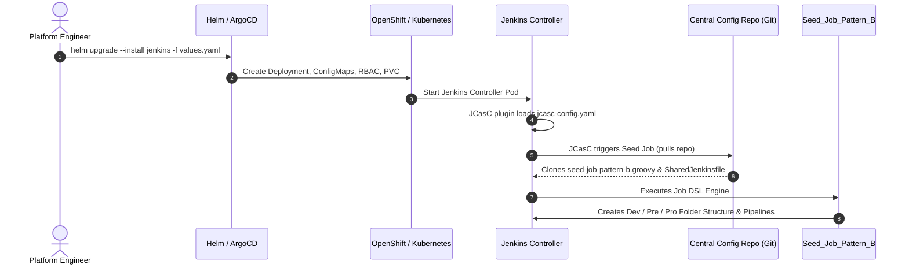
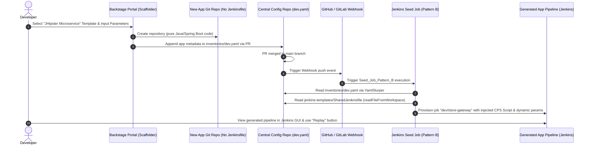
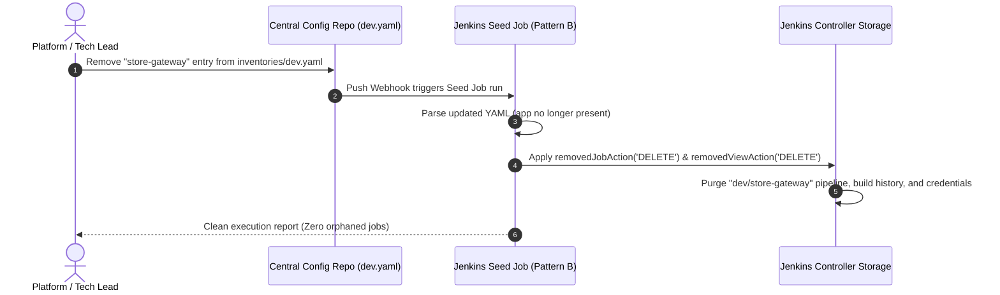

# ⚙️ Jenkins + Backstage GitOps Integration Patterns (2026 Reference Architecture)

> [!WARNING]
> **⚠️ DIDACTIC TEMPLATE ONLY: This repository is a conceptual blueprint generated with Antigravity Gemini 3.7 Flash. It has NOT been tested, validated, or debugged in a live, real-world Kubernetes/OpenShift cluster. Use it solely as a learning guide and architectural reference.**

<!-- ======================================================================= -->
<!-- GITHUB REPOSITORY BADGES                                                -->
<!-- ======================================================================= -->
<p align="center">
  <!-- Core Architecture & GitOps -->
  <a href="https://github.com/nubenetes/jenkins-backstage-2026-poc1"></a>
  <a href="https://jenkins.io"></a>
  <a href="https://backstage.io"></a>
  <a href="https://www.redhat.com/en/technologies/cloud-computing/openshift"></a>
  <a href="https://kubernetes.io"></a>
</p>

<p align="center">
  <!-- Stack & Ecosystem -->
  
  
  
  
  
  
  
  
</p>

<p align="center">
  <!-- Repository Statistics & Standards -->
  <a href="https://github.com/nubenetes/jenkins-backstage-2026-poc1/stargazers"></a>
  <a href="https://github.com/nubenetes/jenkins-backstage-2026-poc1/network/members"></a>
  <a href="https://github.com/nubenetes/jenkins-backstage-2026-poc1/issues"></a>
  <a href="https://github.com/nubenetes/jenkins-backstage-2026-poc1/pulls"></a>
  
  
</p>

---

## 📌 About This Repository

> **One-liner Description (GitHub About):**
> *Production-grade GitOps reference architecture comparing Backstage Scaffolder integration patterns with Jenkins (Reactive Multibranch vs. Centralized JCasC/Job DSL Seed Jobs with Direct CPS Script Injection).*

### 🏷️ GitHub Topics / Tags
`backstage` • `backstage-scaffolder` • `jenkins` • `jenkins-casc` • `jcasc` • `job-dsl` • `gitops` • `openshift` • `kubernetes` • `helm` • `spring-boot` • `jhipster` • `microservices` • `kaniko` • `sonarqube` • `declarative-pipeline` • `devops-platform` • `internal-developer-platform`

---

## 📑 Table of Contents
1. [Executive Summary](#-executive-summary)
2. [Architectural Comparison: Pattern A vs. Pattern B](#-architectural-comparison-pattern-a-vs-pattern-b)
3. [System Architecture & Lifecycle Flows (Mermaid)](#-system-architecture--lifecycle-flows)
   - [Flow 1: Day-1 Bootstrap (JCasC & Seed Job Initialization)](#flow-1-day-1-bootstrap-jcasc--seed-job-initialization)
   - [Flow 2: Day-2 Operations (Backstage $\rightarrow$ YAML Inventory $\rightarrow$ Pipeline Injection)](#flow-2-day-2-operations-backstage--yaml-inventory--pipeline-injection)
   - [Flow 3: Decommissioning & Automated Garbage Collection](#flow-3-decommissioning--automated-garbage-collection)
4. [Deep Dive: Why Direct Pipeline Injection Over Shared Libraries?](#-deep-dive-why-direct-pipeline-injection-over-shared-libraries)
5. [Repository Structure](#-repository-structure)
6. [Component Breakdown](#-component-breakdown)
   - [1. Helm Chart Wrapper (`charts/jenkins-wrapper`)](#1-helm-chart-wrapper-chartsjenkins-wrapper)
   - [2. JCasC Definition (`bootstrap/jcasc-config.yaml`)](#2-jcasc-definition-bootstrapjcasc-configyaml)
   - [3. Job DSL Pattern B Engine (`job-dsl/seed-job-pattern-b.groovy`)](#3-job-dsl-pattern-b-engine-job-dslseed-job-pattern-bgroovy)
   - [4. Shared Declarative Jenkinsfile (`jenkins-templates/SharedJenkinsfile`)](#4-shared-declarative-jenkinsfile-jenkins-templatessharedjenkinsfile)
   - [5. Environment Inventories (`inventories/*.yaml`)](#5-environment-inventories-inventoriesyaml)
   - [6. Backstage Scaffolder Templates (`backstage/templates`)](#6-backstage-scaffolder-templates-backstagetemplates)
   - [7. Sample JHipster Microservice (`samples/jhipster-microservice`)](#7-sample-jhipster-microservice-samplesjhipster-microservice)
7. [Enterprise OpenShift & Kubernetes Considerations](#-enterprise-openshift--kubernetes-considerations)
8. [Step-by-Step Operations Guide](#-step-by-step-operations-guide)

---

## 🎯 Executive Summary

When integrating developer self-service portals (**Spotify Backstage**) with continuous integration engines (**Jenkins**) on modern Kubernetes and Red Hat OpenShift clusters, platform teams face a critical architectural decision: **How should application CI/CD pipelines be created, maintained, standardized, and decommissioned?**

This repository demonstrates and contrasts two major enterprise patterns:
* **Pattern A (Reactive Branch Discovery / Multibranch Pipelines)**: Each application repository contains an individual `Jenkinsfile`. Jenkins monitors organization accounts or repositories and creates pipelines upon discovering branches.
* **Pattern B (Git-Backed Centralized Seed Job / Inventory Model)**: Application repositories contain *no* CI infrastructure code (`Jenkinsfile` is omitted). Applications are registered as metadata entries in environment-specific Git inventories (`inventories/dev.yaml`, `inventories/pre.yaml`, `inventories/pro.yaml`). A centralized Jenkins Seed Job (powered by **Job DSL** and **Jenkins Configuration as Code - JCasC**) reads a single canonical `SharedJenkinsfile` using `readFileFromWorkspace` and injects it directly into dynamically provisioned Jenkins pipeline jobs.

---

## ⚖️ Architectural Comparison: Pattern A vs. Pattern B

| Evaluation Dimension | Pattern A: Reactive Branch Discovery (Multibranch) | Pattern B: Centralized Seed Job (Inventory-Driven) |
| :--- | :--- | :--- |
| **Day-1 Complexity** | **Low**. Quick to set up. Requires configuring GitHub/GitLab org folders or multibranch webhooks. | **Medium**. Requires configuring JCasC, Job DSL Seed Job, and structured YAML inventories in a control repository. |
| **Day-2 Maintenance (Enterprise Governance)** | **Very High Pain**. Adding a mandatory step (e.g., SonarQube quality gate or Trivy container scan) across 200+ microservices requires opening 200+ Git PRs or enforcing rigid Shared Libraries. | **Near Zero Pain**. Updating `jenkins-templates/SharedJenkinsfile` in this central repo immediately updates all 200+ jobs upon the next Seed Job run. |
| **Developer Experience (UI & Replay)** | **Variable**. If using Shared Libraries, custom steps obscure pipeline logic. Replay functionality may be disabled or crash due to dynamic CPS mismatch. | **Superior**. Injected declarative Jenkinsfile is rendered directly in the Jenkins GUI. Developers have full access to the **Pipeline Replay** button for debugging. |
| **App Repository Hygiene** | **Polluted**. Every microservice repository contains boilerplate pipeline scripts, credentials references, and cluster-specific configurations. | **Clean & Zero-Config**. Application repositories contain pure business code (e.g., JHipster Spring Boot), completely decoupled from CI/CD tooling. |
| **Configuration Drift** | **High**. Teams modify or fork their local `Jenkinsfile`, introducing security holes, disabled linters, or outdated container base images. | **Zero**. Standardized centrally. Environment variables, resources, and stages are driven strictly by the YAML inventories. |
| **Decommissioning & Cleanup** | **Manual / Orphaned**. Deleting an app repository leaves orphaned jobs, credentials, and cron triggers in Jenkins unless manual sweeping is performed. | **Automated & Instantaneous**. Removing the application block from `inventories/dev.yaml` triggers Job DSL garbage collection (`removedJobAction('DELETE')`). |
| **Branching Strategy Handling** | Native to Git branch names (e.g. `feature/*`, `bugfix/*`). | Configured per environment in YAML (e.g., `dev` targets `develop`/`feature/*`, `pro` targets `main`/`release/*`). |

---

## 📊 System Architecture & Lifecycle Flows

### Flow 1: Day-1 Bootstrap (JCasC & Seed Job Initialization)
This flow illustrates how Jenkins is provisioned in OpenShift/Kubernetes with zero manual UI interaction using Helm and Jenkins Configuration as Code (JCasC).



---

### Flow 2: Day-2 Operations (Backstage $\rightarrow$ YAML Inventory $\rightarrow$ Pipeline Injection)
This flow demonstrates a developer scaffolding a new JHipster microservice via Backstage, which registers the service in GitOps inventories and automatically yields an active, replayable Jenkins pipeline.



---

### Flow 3: Decommissioning & Automated Garbage Collection
This flow shows how simple deletion of metadata in the Git inventory safely purges Jenkins pipelines and folders without manual operator intervention.



---

## 🔍 Deep Dive: Why Direct Pipeline Injection Over Shared Libraries?

In standard enterprise Jenkins setups, teams frequently use **Jenkins Shared Libraries (JSL)** (e.g. `@Library('my-shared-lib') _`). While JSL has historically been popular, it introduces severe architectural friction at scale:

1. **The "Replay Pipeline" Death Trap**:
   When a developer clicks **Replay** in the Jenkins UI, Jenkins only allows editing the entry-point `Jenkinsfile`. Code encapsulated in remote Shared Library classes (`vars/*.groovy`, `src/**/*.groovy`) cannot be modified in the replay editor. Direct injection via `definition { cps { script(injectedPipelineCode) } }` puts the complete pipeline script into the job definition, making the entire pipeline interactive and editable during replay debugging.

2. **UI Transparency & Developer Autonomy**:
   Shared libraries turn pipelines into opaque black boxes (e.g., `standardPipeline()`). Developers cannot inspect the exact logic, environment parameters, or execution steps from the Jenkins classic UI. With injected declarative templates, the script is directly visible under the job's **Pipeline Script** view.

3. **Versioning & Blast Radius Isolation**:
   A bug introduced in a centrally loaded `@Library('my-shared-lib@master')` can immediately break builds across thousands of repositories simultaneously. With Pattern B, template changes can be tested against individual environments (`dev.yaml` first, then `pre.yaml`, then `pro.yaml`) by branching the Seed Job configuration repository or applying environment-level template mappings.

4. **Eliminating Global Pipeline Sandbox Escapes**:
   Directly injected declarative pipelines execute strictly within standard CPS sandbox constraints, preventing malicious or buggy shared library code from executing unsandboxed methods on the Jenkins master.

---

## 📂 Repository Structure

```text
.
├── README.md                          # Comprehensive documentation, comparison, and diagrams
├── charts/
│   └── jenkins-wrapper/               # Custom Helm Chart wrapper for Jenkins
│       ├── Chart.yaml                 # Helm Chart metadata with Jenkins dependency
│       └── values.yaml                # JCasC, plugins setup, and automated Seed Job configuration
├── bootstrap/
│   └── jcasc-config.yaml              # Standalone JCasC configuration showing raw Seed Job loading
├── job-dsl/
│   ├── seed-job-pattern-a.groovy      # Job DSL for Pattern A (Organization folder / Branch scan)
│   └── seed-job-pattern-b.groovy      # Job DSL for Pattern B (YAML inventory iterator + readFileFromWorkspace)
├── jenkins-templates/
│   └── SharedJenkinsfile              # Shared Declarative Jenkinsfile template (injected via Job DSL)
├── inventories/                       # Pattern B Multi-Environment Inventories
│   ├── dev.yaml                       # Microservices list and parameters for Dev
│   ├── pre.yaml                       # Microservices list and parameters for Pre-production
│   └── pro.yaml                       # Microservices list and parameters for Production
├── backstage/
│   └── templates/
│       ├── pattern-a-app-template.yaml # Backstage template: provisions app with local Jenkinsfile
│       └── pattern-b-app-template.yaml # Backstage template: registers app in inventories/ (No Jenkinsfile)
├── samples/
│   └── jhipster-microservice/         # Minimal JHipster Java microservice stub (No Jenkinsfile in repo)
│       ├── pom.xml                    # Spring Boot / Maven definition
│       └── src/                       # Application code stub
└── bin/                               # Simplified operational scripts (Day 1, Day 2, Decommission)
    ├── bootstrap.sh                   # Unified script to spin up the local/OpenShift setup
    ├── register-app.sh                # Simulation script: registers a new app in Pattern B inventories
    └── decommission.sh                # Simulation script: removes an app and triggers cleanup
```

---

## 🧩 Component Breakdown

### 1. Helm Chart Wrapper (`charts/jenkins-wrapper`)
Wraps the official Jenkins Helm Chart (`jenkins/jenkins`) and packages the required Kubernetes configurations:
* **Pre-installed Plugins**: `configuration-as-code`, `job-dsl`, `kubernetes`, `workflow-aggregator`, `git`, `sonar`, `pipeline-stage-view`.
* **JCasC Integration**: Mounts the Job DSL bootstrap scripts directly into the controller container.
* **Kubernetes Pod Cloud**: Pre-configures the dynamic Pod Cloud for agent scheduling.

### 2. JCasC Definition (`bootstrap/jcasc-config.yaml`)
Configures the Jenkins controller as code:
* Sets up security realms and authorization matrices.
* Defines the Kubernetes cloud provider with container agent specifications (`maven`, `kaniko`, `oc-cli`).
* Provisions the initial bootstrap **Seed Job** that clones this repository and executes `job-dsl/seed-job-pattern-b.groovy`.

### 3. Job DSL Pattern B Engine (`job-dsl/seed-job-pattern-b.groovy`)
A Groovy script that:
* Uses `groovy.yaml.YamlSlurper` to parse `inventories/dev.yaml`, `inventories/pre.yaml`, and `inventories/pro.yaml`.
* Creates top-level environment folders (`dev`, `pre`, `pro`) and application subfolders.
* Reads `jenkins-templates/SharedJenkinsfile` using `readFileFromWorkspace`.
* Injects the pipeline code directly via `cps { script(...) }`.
* Dynamically maps YAML metadata (JVM limits, replicas, namespace, Git branch, SonarQube flags) into Jenkins job environment variables and parameters.
* Configures `removedJobAction('DELETE')` and `removedViewAction('DELETE')` for zero-touch decommissioning.

### 4. Shared Declarative Jenkinsfile (`jenkins-templates/SharedJenkinsfile`)
A declarative pipeline template for JHipster/Java microservices with:
* **Dynamic Pod Agent**: Runs multi-container pods (`maven`, `sonar-scanner`, `kaniko`, `openshift-cli`).
* **Environment-Aware Stages**:
  * `Compile & Test`: Maven build and Jacoco test reports.
  * `Security & Quality`: SonarQube analysis and dependency scanning.
  * `Container Image Build`: Kaniko or OpenShift BuildConfigs (executes on `dev` or on release tags).
  * `Continuous Deployment`: GitOps sync / OpenShift deployment rollout to the target namespace.

### 5. Environment Inventories (`inventories/*.yaml`)
Structured configuration matrices defining the desired state of all microservices per environment:
```yaml
environment: dev
cluster: openshift-dev-cluster-01
namespace: apps-dev
defaults:
  jvm_memory: "-Xms512m -Xmx1024m"
  cpu_limit: "1000m"
  memory_limit: "1Gi"
applications:
  - name: store-gateway
    team: e-commerce
    repository: "https://github.com/nubenetes/sample-jhipster-gateway.git"
    branch: "develop"
    sonar_enabled: true
    replicas: 2
```

### 6. Backstage Scaffolder Templates (`backstage/templates`)
* **`pattern-a-app-template.yaml`**: The classic template. Generates an application repository containing a static `Jenkinsfile` inside the app root.
* **`pattern-b-app-template.yaml`**: The GitOps inventory template. Clones the application boilerplate *without* a `Jenkinsfile`, then uses Backstage actions (`fetch:plain`, file append, and `publish:github:pull-request`) to submit a Pull Request to this configuration repository's `inventories/dev.yaml`.

### 7. Sample JHipster Microservice (`samples/jhipster-microservice`)
A standard Java 21 / Spring Boot 3 JHipster microservice stub. Notice that **no `Jenkinsfile` exists in this folder**, proving complete isolation between developer business code and platform CI/CD pipelines.

---

## 🛡️ Enterprise OpenShift & Kubernetes Considerations

When running this architecture on Red Hat OpenShift:
1. **Security Context Constraints (SCC)**:
   * Dynamic agent pods must run with the `restricted-v2` or `anyuid` SCC depending on container image requirements.
   * Container builds should leverage **Kaniko** (rootless/daemonless) or OpenShift native **BuildConfigs** (Source-to-Image / Docker strategy) to avoid mounting Docker sockets.
2. **Service Accounts & RBAC**:
   * Jenkins Controller requires a dedicated ServiceAccount with permissions to spawn pods in the `jenkins-agents` namespace (`RoleBinding` to `system:image-puller` and pod manager roles).
3. **OpenShift Route & TLS**:
   * Jenkins Controller is exposed via an edge or re-encrypt OpenShift `Route` with sticky sessions enabled for seamless UI interaction.

---

## 🚀 Step-by-Step Operations Guide

### 1. Day-1: Bootstrap Jenkins Controller
Deploy Jenkins with the Helm wrapper and bootstrap the Seed Job:
```bash
# Execute Day-1 bootstrap script
./bin/bootstrap.sh --namespace jenkins-ci --environment dev
```

### 2. Day-2: Register a New Application (Simulating Backstage)
Simulate the Backstage Scaffolder registering a new microservice:
```bash
# Register a new microservice in dev.yaml
./bin/register-app.sh \
  --name payment-service \
  --team finance \
  --repo https://github.com/nubenetes/sample-payment-service.git \
  --branch develop \
  --environment dev
```

### 3. Day-3: Decommission an Application
Cleanly retire an application and trigger automatic job deletion in Jenkins:
```bash
# Remove application from dev.yaml inventory
./bin/decommission.sh \
  --name payment-service \
  --environment dev
```

---

## 📜 License
This project is licensed under the Apache License 2.0. Reference implementation provided by **nubenetes**.
